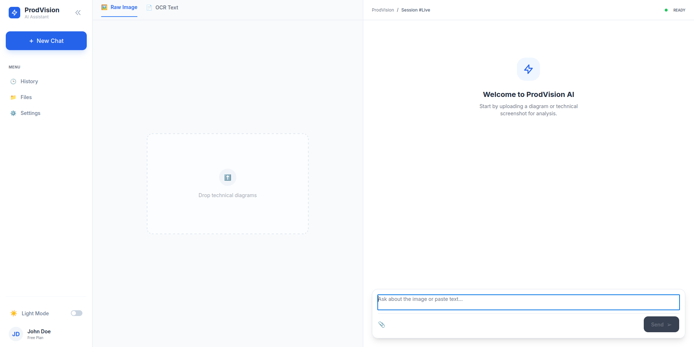

---

# 🧠 ProdVision – Personal Multimodal AI Assistant

ProdVision is a **personal AI assistant project** designed to support **text-based and image-based interactions**.
The system allows users to upload images, extract text using **OCR**, and pass the extracted content to a **Large Language Model (LLM)** for reasoning and response generation.

This project is built **for personal learning and productivity**, focusing on **AI model integration, system design, real-time interaction**, and **context-aware reasoning**, rather than large-scale production.

---
# Main view:


--- 


## 🔗 Related Repositories

* Backend (this repo): [https://github.com/vantoan2905/ProdVision_Server](https://github.com/vantoan2905/ProdVision_Server)
* Frontend (UI): [https://github.com/vantoan2905/prodvision-ai-assistant](https://github.com/vantoan2905/prodvision-ai-assistant)

---

## ✨ Key Features

* 📷 **Image Upload & OCR**
  Extracts text from user-uploaded images using pretrained OCR models. Supports both **standard documents** and **tables**, with modular pipelines:

  * **Documents:** Structure Analysis → Merch Patch → Line Detection → Text Recognition → Paragraph Reconstruction
  * **Tables:** Structure Analysis → Merch Patch → Cell Detection → Line Detection → Text Recognition → Table Reconstruction

* 🧠 **Context-aware LLM Integration**

  * Dynamically injects user-specific knowledge from processed documents into prompts
  * Improves response relevance and reduces hallucinations
  * Supports RAG-based retrieval with embeddings & cosine similarity for private context reasoning

* ⚡ **Real-time Chat via Server-Sent Events (SSE)**
  Streams incremental LLM responses to the client in real time.

* 🔐 **User & Conversation Management**
  Supports multiple users, conversations, message history, and context tracking.

* 🐳 **Dockerized Deployment**
  Easy local setup and consistent runtime environment.

* 🧩 **Backend & AI Stack**

  * Python, Django, Django REST Framework, NestJS
  * OCR: PaddleOCR, OpenCV
  * Data processing: NumPy, Pandas
  * LLM integration: LangChain, GLM-4-Flash

---

## 🏗️ System Architecture

```text
Client
  ├── Upload image / send message
  ↓
Backend (Django / NestJS)
  ├── OCR inference (image → text)
  ├── Modular pipelines for documents & tables
  ├── Context-aware LLM integration & RAG retrieval
  ├── Conversation & user context management
  └── SSE streaming response
  ↓
Client (real-time updates)
```
---
### 📊 OCR & RAG Flowcharts

#### RAG Retrieval Flow


#### OCR Pipeline Flow

---

## 🛠️ Tech Stack

* **Backend:** Django
* **AI / Data Processing:** OCR (PaddleOCR), OpenCV, NumPy, Pandas
* **LLM Integration:** LangChain, GLM-4.6, context-aware prompts, RAG retrieval
* **Database:** PostgreSQL, Redis
* **Realtime Communication:** Server-Sent Events (SSE)
* **Containerization:** Docker

---

## 📂 Project Structure

```text
ProdVision_Server/
│   ├── users/           # User management
│   ├── config/          # Main application settings
│   ├── chat/            # Conversations & messages
│   ├── files/           # OCR inference pipeline (documents & tables)
│   ├── llm/             # LLM integration & context management
│   └── core/            # Shared utilities
├── media/               # Uploaded images
├── requirements.txt
├── Dockerfile
├── docker-compose.yml
└── README.md
```

---

## 🚀 Getting Started

### 1️⃣ Clone the repository

```bash
git clone https://github.com/vantoan2905/ProdVision_Server.git
cd ProdVision_Server
```

### 2️⃣ Create virtual environment & install dependencies

```bash
python3 -m venv venv
source venv/bin/activate
pip install -r requirements.txt
```

### 3️⃣ Apply database migrations

```bash
python manage.py migrate
```

### 4️⃣ Run the development server

```bash
python manage.py runserver
```

Server will be available at: `http://127.0.0.1:8000`
Swagger docs: `http://127.0.0.1:8000/docs`

---

## 🐳 Run with Docker (Recommended)

```bash
docker-compose up --build
```

---

## 🔄 Application Workflow

1. User uploads an image or sends a message.
2. Backend processes the image via **modular OCR pipelines** for documents or tables.
3. Extracted text is passed to **context-aware LLM** with optional RAG retrieval.
4. LLM generates a response based on text + conversation context.
5. Response is streamed back to client via **SSE**.
6. Optional: conversation history, tensor data, or user tokens can be temporarily cached in **Redis** before persisting to DB.

---

## ⚠️ Project Scope

* Personal project for **learning & experimentation**
* Uses pretrained OCR and LLM models
* Designed for personal usage, not large-scale production

---

## 📌 Future Improvements

* Improve OCR accuracy for complex layouts and curved text
* Add file type support (PDF, scanned documents)
* Enhance conversation memory, summarization, and context handling
* Add frontend UI for better user interaction
* Extend caching & Redis usage for tensor/image data and temporary tokens

---

## 📄 License

This project is for **personal and educational purposes**.

---

## 🙋 Author

**Nguyen Van Toan**
- AI Engineer 
- GitHub: [https://github.com/vantoan2905](https://github.com/vantoan2905)

---

